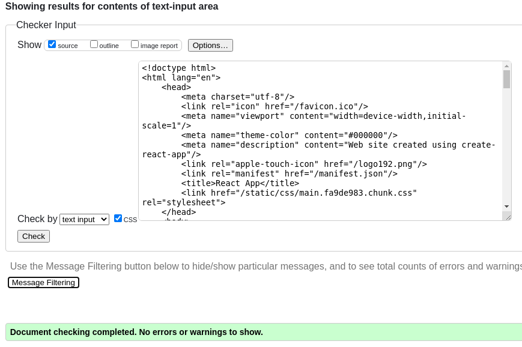
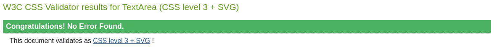
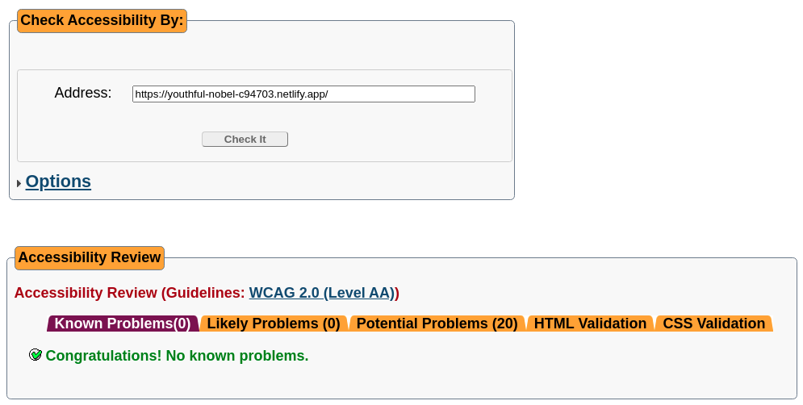
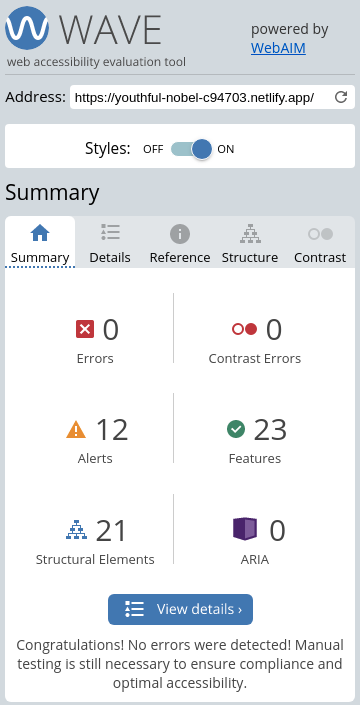

# 263 Final Project

This project was bootstrapped with [Create React App](https://github.com/facebook/create-react-app).
  In order to run this project locally, please run `npm start`
  Otherwise visit a hosted version [Here](https://263-final.netlify.app/).

# Validity and Accessibility

### W3C HTML Check

### W3C CSS Check

### A Checker Accessibility Check

### Wave Accessibility Check

# Lists of Resources and Such

This project utilized React (bootstrapped with Create-React-App)
, [react-three-fiber](https://github.com/pmndrs/react-three-fiber)
which is a library for utilizing ThreeJs within React. We consulted the React-Three-Fiber documentation, and youtube
videos like [this one](https://www.youtube.com/watch?v=Q7AOvWpIVHU).
  We also consulted a number of articles and such to identify issues with different aspects of our build. For
instance, Netlify oddly sometimes doesn't like %s for opacity. Otherwise, we did not use outside resources nor consult
other students.
  It would be impractical to list all the different html tags and css used within the project. The main html and css
related module used in this project was [Material UI](https://material-ui.com/) which is a React component library for
building responsive website easily.
